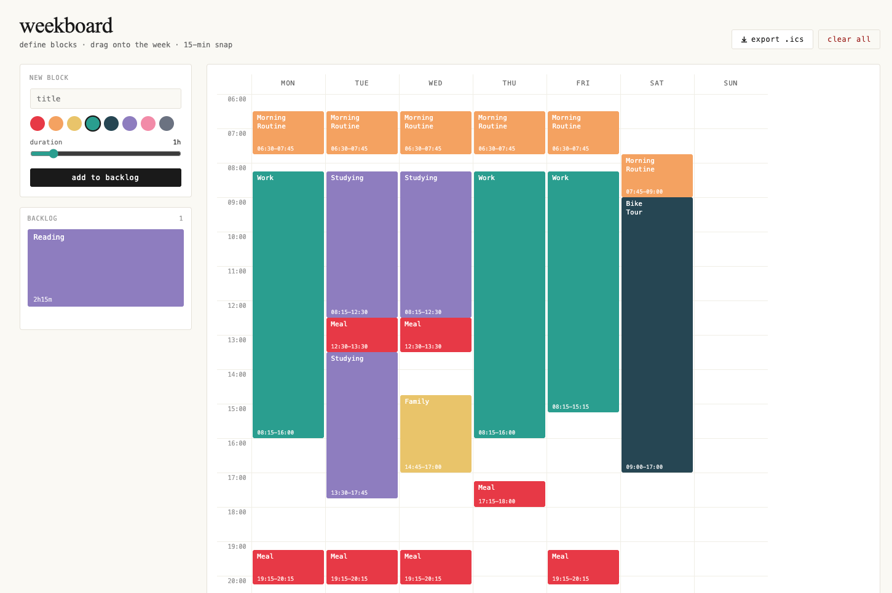

# weekboard

A drag-and-drop weekly time-block planner. Define blocks, drag them onto a week grid with 15-minute snap.

> ⚠️ **Vibe-coded.** This was built with AI assistance in a single session. It works, but don't expect production-grade code.

## Features

- Drag blocks from a backlog onto a 7-day / 6:00–23:00 grid
- 15-minute snap granularity
- Resize placed blocks by dragging the bottom edge
- Duplicate and split blocks
- Drag blocks back to backlog to unplace them
- Reorder backlog via drag and drop
- Export to .ics
- All state is in-memory (no persistence)

## Run

Just open `index.html` in a browser. No build step required.

Uses React 18 + Babel standalone from CDN for in-browser JSX.

## License

MIT
